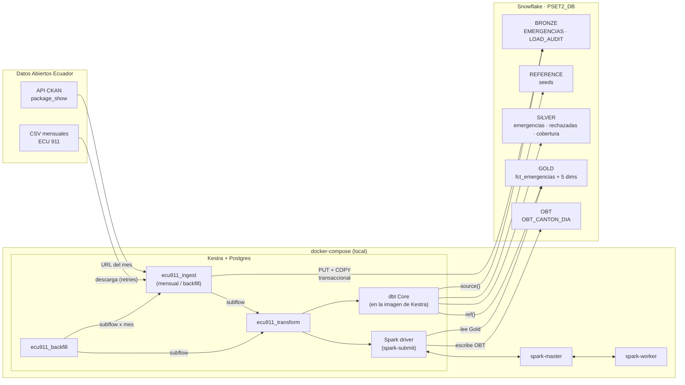

# Arquitectura

## Diagrama de infraestructura

## Flujo de datos

`Fuente → Kestra → Bronze → dbt → Silver → dbt → Gold → Spark → OBT`

| Paso | Componente | Qué hace |
|---|---|---|
| 1 | Kestra `ecu911_ingest` · `resolve_resource` | Consulta la API CKAN del portal y obtiene la URL del CSV del mes (las URLs tienen IDs aleatorios, no se pueden construir). |
| 2 | Kestra · `download` | Descarga el CSV (~35 MB) con reintentos exponenciales. |
| 3 | Kestra · `load_bronze` | Detecta la codificación (UTF-8 o CP1252), transcodifica a UTF-8, hace `PUT` al stage y en una transacción `DELETE` del período + `COPY INTO BRONZE.EMERGENCIAS`. Valida filas cargadas = filas del archivo y registra en `LOAD_AUDIT`. |
| 4 | dbt · Silver | Tipos, estandarización de textos, catálogo de servicios, códigos DPA, cuarentena de inválidos, control de cobertura mensual. |
| 5 | dbt · Gold | Esquema estrella: `fct_emergencias` + `dim_fecha`, `dim_canton`, `dim_parroquia`, `dim_servicio`, `dim_tipo_emergencia`. Tests. |
| 6 | Spark · `build_obt.py` | Lee Gold, construye el panel cantón × día con lags y calendario, valida grano y joins, escribe `OBT.OBT_CANTON_DIA`. |

## Orquestación

| Flow | Disparo | Qué ejecuta |
|---|---|---|
| `ecu911_ingest` | Trigger `Schedule` mensual (día 20, 07:00 America/Guayaquil) o manual con `period` | Un mes → Bronze. Al final llama a `ecu911_transform` (si `run_transform = true`). |
| `ecu911_backfill` | Manual | `ForEach` sobre los meses del rango (4 en paralelo) → subflow `ecu911_ingest` con `run_transform = false`; luego una sola vez `ecu911_transform`. |
| `ecu911_transform` | Subflow | `dbt deps` → `dbt build` → `spark-submit`. `concurrency: 1` en cola. |

**Retries y errores:** `resolve_resource` (3 intentos, 1 min), `download` (4 intentos con backoff exponencial 30 s → 5 min), `load_bronze` (3 intentos, 1 min), `dbt_build` y `spark_obt` (2 intentos). Cada flow tiene un bloque `errors` que registra el período y la ejecución fallidos. Como la carga de un mes es transaccional, un fallo nunca deja Bronze a medias.

**Backfill:** dos mecanismos. (1) El flow `ecu911_backfill` (recomendado: controla el paralelismo y transforma una sola vez). (2) El backfill nativo del trigger `monthly` de `ecu911_ingest` en la UI de Kestra: el período se calcula como el mes anterior a la fecha programada, así que un backfill del 2023-02-20 al 2026-04-20 genera una ejecución por mes de 2023-01 a 2026-03.

**Idempotencia:** cada mes se reemplaza completo en Bronze (`DELETE` + `COPY` en transacción); Silver y el hecho son incrementales `delete+insert` por `source_period`; las dimensiones y la OBT se reconstruyen (`table` / `overwrite`).
