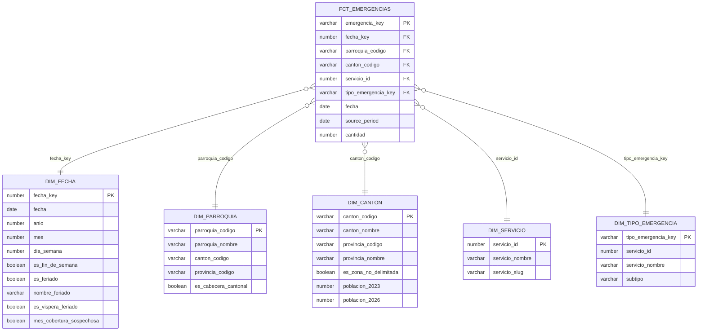

# Modelo dimensional (Gold) y OBT

## Star schema

### Grano de la tabla de hechos

**`fct_emergencias`: una fila = una emergencia coordinada por el ECU 911** (una fila válida del
CSV mensual). Es el grano atómico disponible: la fuente no tiene hora ni ID, así que no existe un
nivel más fino.

- **PK:** `emergencia_key = md5(período del archivo | número de fila)`. La fuente no trae ID y
  las filas idénticas son emergencias distintas, por eso la llave es la posición en el archivo.
- **Medida:** `cantidad = 1` (hecho *factless*). Se suma para obtener volúmenes.
- **FKs:** `fecha_key`, `parroquia_codigo`, `canton_codigo`, `servicio_id`, `tipo_emergencia_key`.
  `canton_codigo` es redundante con la parroquia (sus 4 primeros dígitos), pero se incluye porque
  el cantón es la unidad de predicción del proyecto; un test garantiza la consistencia.

### Dimensiones

| Dimensión | PK | Para qué sirve en el proyecto |
|---|---|---|
| `dim_fecha` | `fecha_key` (YYYYMMDD) | Estacionalidad (día de la semana, mes), feriados y víspera, marca de meses incompletos. |
| `dim_canton` | `canton_codigo` (DPA, 4 dígitos) | Unidad de predicción; población INEC para normalizar (tasa por 100 mil). |
| `dim_parroquia` | `parroquia_codigo` (DPA, 6 dígitos) | Detalle geográfico fino y jerarquía parroquia → cantón → provincia. |
| `dim_servicio` | `servicio_id` | Institución que atiende (7 servicios + "no especificado"). |
| `dim_tipo_emergencia` | `tipo_emergencia_key` | Subtipo asignado por el operador dentro de cada servicio. |

## OBT (Spark)

**`OBT.OBT_CANTON_DIA`: una fila = un cantón × un día**, para todo el rango con datos
(panel completo: los días sin emergencias existen con volumen 0).

| Grupo | Columnas |
|---|---|
| Llave | `CANTON_CODIGO`, `FECHA` (`FECHA_KEY`) |
| Cantón | nombre, provincia, zona no delimitada, `POBLACION` del año, `TASA_100K` |
| Volumen del día | `N_EMERGENCIAS` y uno por servicio (`N_SEGURIDAD_CIUDADANA`, `N_TRANSITO_MOVILIDAD`, …) |
| Historia (solo pasado) | `N_LAG_1/7/14/28`, `N_MEDIA_7D`, `N_MEDIA_28D` |
| Calendario | año, mes, día de la semana, fin de semana, feriado, víspera, post-feriado, `MES_COBERTURA_SOSPECHOSA` |
| Futuro (para el target) | `N_T_MAS_3`, `N_T_MAS_7` |

**Validación de joins** (se guarda en `OBT.OBT_VALIDACIONES`; si falla, no se reemplaza la OBT):
filas = cantones × días; llave (cantón, día) única; suma de `N_EMERGENCIAS` = filas de
`fct_emergencias`; llaves sin nulos.

**Por qué el target no está en la OBT:** el PSet #1 define `y = 1` si el volumen supera el P90
del cantón y día de la semana, calculado **solo con el período de entrenamiento**. Calcularlo sobre
todo el histórico en la OBT filtraría información del futuro; la OBT entrega los insumos
(`N_T_MAS_3`, `N_T_MAS_7`, `DIA_SEMANA`) y el target se construye en el split de modelado.

## Star schema vs. OBT en este proyecto

- **Star schema:** análisis exploratorio y reportes flexibles (volumen por provincia, servicio,
  subtipo, feriados…), y como fuente única y validada. Cambiar una dimensión no obliga a
  reprocesar hechos.
- **OBT:** entrenamiento y scoring del modelo de gradient boosting: una tabla plana al grano de la
  predicción (cantón-día), sin joins en el notebook, con las features ya calculadas de forma
  consistente entre entrenamiento y producción.
